# Arquitectura — Observatorio de Deforestación CORPOURABA

Este documento describe los componentes del sistema, el flujo de datos desde
el paquete crudo de monitoreo hasta la interfaz web, y las decisiones de
diseño que sustentan la implementación. El contrato normativo (rutas, tipos,
endpoints) vive en [`SPEC.md`](../SPEC.md).

## 1. Vista de componentes

```mermaid
flowchart LR
    subgraph CRUDOS["📦 Datos crudos (monitoreo CORPOURABA)"]
        SHP["Shapefiles municipales<br/>por periodo (11)"]
        XLS["Excel de atributos<br/>(2000-2002, 2014-2015)"]
        CUE["Excel de cuencas<br/>(2015-2016, 2016-2017)"]
        RAS["Rásters DEPTO_ANTIOQUIA<br/>(2012-2013 + RAT 2010-2012)"]
    end

    subgraph ETL["⚙️ ETL (etl/run_etl.py — offline)"]
        NORM["Normalización de nombres<br/>y clases (encoding roto)"]
        CAL["Calibraciones<br/>(cuencas 2015-2016, RAT 2010-2012)"]
        EST["Estimación de vacíos<br/>(2010-2012, 2018-2019, 2023-2024)"]
        QA["QA vs hojas «Cálculos»"]
    end

    subgraph PROC["🗃️ data/processed/"]
        GEO["municipios.geojson<br/>subregiones.geojson"]
        CSV["serie_municipal.csv<br/>serie_regional.csv"]
        HOT["hotspots/&lt;periodo&gt;.geojson (12)"]
        CAP["capas/*.geojson (4)"]
        MET["metadata.json"]
    end

    subgraph API["🚀 Backend FastAPI (:8000)"]
        REPO["repository.py<br/>(archivos EN MEMORIA — default)"]
        REPG["repository_postgis.py<br/>(misma interfaz, opcional)"]
        ANA["analytics.py<br/>KPIs · breaks · ranking · predicción"]
        DWN["downloads.py<br/>CSV/XLSX/GeoJSON/ZIP dinámicos"]
        RUT["routers: geo · series<br/>analitica · descargas (/api/v1)"]
    end

    PG[("🐘 PostgreSQL + PostGIS<br/>(opcional, vía DATABASE_URL)")]

    subgraph WEB["🖥️ Frontend Next.js 14 (:3000)"]
        LIB["lib: api.ts · types.ts<br/>format.ts · colores.ts"]
        STORE["store zustand<br/>(periodo, métrica, capas...)"]
        MAPA["/mapa<br/>Leaflet + choropleth + timelapse"]
        DASH["/dashboard<br/>recharts + predicción"]
        EDU["/aprende<br/>PRAES: quiz + juego"]
        DAT["/datos<br/>descargas + diccionario"]
    end

    USUARIO(("👥 Ciudadanía,<br/>colegios, técnicos"))

    CRUDOS --> ETL --> PROC
    PROC -->|"carga al startup (lifespan)"| REPO
    PROC -->|"etl/load_postgis.py"| PG
    PG --> REPG
    REPO --> ANA & DWN
    REPG --> ANA & DWN
    ANA & DWN --> RUT
    RUT -->|"JSON / archivos (HTTP)"| LIB
    LIB --> STORE --> MAPA & DASH & EDU & DAT
    MAPA & DASH & EDU & DAT --> USUARIO

    CARTO["🗺️ Teselas CARTO<br/>© OpenStreetMap · © CARTO"] --> MAPA
```

## 2. Flujo de datos: crudos → ETL → API → UI

### Etapa 1 — Datos crudos

El paquete original del monitoreo de bosque contiene, por periodo, alguna
combinación de: shapefiles municipales (`*_Mpios_*.shp`), tablas Excel de
atributos (`*_Mpios_Dat.xls[x]`), cruces con cuencas (`*_Cuenc_Dat.xlsx`) y
rásters departamentales (`DEPTO_ANTIOQUIA_<periodo>.img`, 30 m). La calidad es
heterogénea: nombres con encoding roto (`CA�ASGORDAS`), erratas en clases
(`NO BOSQUE ESTBLE`), CRS a veces ausente y cobertura desigual entre periodos.

### Etapa 2 — ETL (`etl/run_etl.py`, se ejecuta offline)

Seis pasos, con log completo persistido en `metadata.json`:

1. **Límites municipales**: dissolve por municipio del shapefile más reciente
   completo (2021-2022), relleno de huecos del teselado, simplificación a 80 m
   y reproyección a WGS84.
2. **Serie municipal**: para cada periodo se usa la **mejor fuente disponible**
   según la jerarquía `shapefile > excel > cuencas > raster > estimado`
   (ver [diccionario-datos.md](diccionario-datos.md) §3.1). Las áreas de los
   shapefiles se recalculan por geometría en CRS métrico (EPSG:3115).
3. **Estimación de vacíos**: los periodos sin fuente municipal (2010-2012,
   2018-2019, 2023-2024) se rellenan **solo para la clase Deforestación** por
   interpolación/tendencia de la tasa anual, con `estimado=True`.
4. **Hotspots**: polígonos de deforestación ≥ 1 ha por periodo, simplificados
   a 40 m para peso web (12 periodos disponibles).
5. **Capas de contexto**: áreas protegidas, resguardos indígenas, consejos
   comunitarios y cuencas, con la deforestación reciente dentro de cada unidad.
6. **QA**: comparación contra las hojas «Cálculos» de los Excel originales
   (todas las diferencias < 0,3 %).

Las **calibraciones** (2015-2016 por cuencas, 2010-2012 por RAT del ráster) se
aplican dentro del paso 2–3; ver decisiones D4 y D5 más abajo.

### Etapa 3 — Backend (FastAPI, `/api/v1`)

Al arrancar (evento *lifespan*), `repository.py` carga en memoria:

- la serie municipal como `DataFrame` de pandas (parseando `estimado` a bool),
- los GeoJSON como `dict` crudos (se sirven tal cual, sin geopandas),
- `metadata.json`,
- índices por `codigo_dane` y por nombre normalizado (sin tildes, mayúsculas),
  de modo que `/serie?municipio=Apartadó` y `?municipio=apartado` son equivalentes.

Sobre ese repositorio, `analytics.py` calcula KPIs, breaks de quantiles para
el choropleth, ranking y la predicción por regresión lineal; `downloads.py`
genera CSV (con BOM y cabecera de metadatos), XLSX (hoja `datos` + hoja
`metadatos`) y el ZIP del paquete completo. Los routers exponen todo bajo
`/api/v1` con validación Pydantic y CORS configurable.

Si existe `DATABASE_URL`, `config.crear_repositorio()` intenta
`repository_postgis.py` (import perezoso); ante cualquier fallo registra un
*warning* y cae al modo archivos. Ambos repositorios implementan la misma
interfaz, así que los routers no distinguen el origen de los datos.

### Etapa 4 — Frontend (Next.js 14, App Router)

- `lib/api.ts` es el único punto de contacto con el API (cliente HTTP tipado
  según el contrato del SPEC §5–6); `lib/types.ts` replica los esquemas.
- `store/useAppStore.ts` (zustand) mantiene el estado compartido entre
  módulos: periodo activo, métrica, timelapse, capas activas, municipio
  seleccionado e inclusión de estimados.
- `/mapa` monta Leaflet con `dynamic import` y `ssr:false` (Leaflet no soporta
  SSR); el choropleth colorea los 19 municipios con los breaks del endpoint.
- `/dashboard` recalcula KPIs en cliente sobre `/serie` filtrada y usa
  recharts para los cinco gráficos.
- Los datos estimados llevan **siempre** distintivo visual (borde discontinuo
  `4 3`, badge «estimado», relleno rayado en gráficos).

## 3. Decisiones de diseño

### D1 — Archivos en memoria como modo por defecto (sin base de datos)

El dataset completo es pequeño y esencialmente **estático**: la serie tiene
1.123 filas, los GeoJSON pesan < 5 MB cada uno y solo cambian cuando la
Corporación publica un nuevo periodo (una vez al año). Cargarlo todo en
memoria al arranque da respuestas en microsegundos, elimina la operación de
una base de datos (backups, credenciales, migraciones) y permite desplegar el
API en cualquier servidor con solo `pip install` — un criterio importante para
una corporación regional con capacidad TI limitada. Los GeoJSON se sirven como
JSON crudo, por lo que el runtime del API **no necesita geopandas** ni ninguna
dependencia geoespacial pesada.

PostGIS queda como modo **opcional** detrás de la misma interfaz de
repositorio (patrón *Repository*): quien necesite consultas espaciales ad hoc,
integración con otros sistemas SIG o multiusuario de escritura puede activar
`DATABASE_URL` sin tocar una línea de los routers. El *fallback* automático a
archivos garantiza que un fallo de la base nunca tumba la plataforma.

### D2 — ETL offline separado del API

El procesamiento pesado (geopandas, rasterio, dissolve, simplificación) ocurre
una sola vez, fuera de línea. El API solo lee resultados. Esto mantiene el
runtime liviano, hace reproducible el pipeline (`python etl/run_etl.py`) y
deja rastro auditable: `metadata.json` conserva el log del ETL, la fuente de
cada periodo y los resultados del QA.

### D3 — Anualización (`hectareas_anuales`) para comparabilidad

Los 5 primeros periodos duran 2 años y el resto 1. Comparar hectáreas brutas
sesgaría la lectura, así que toda la serie incluye la tasa anualizada y la UI
la usa por defecto en comparaciones temporales.

### D4 — Calibración 2015-2016 por factores de cuencas

2015-2016 solo existe vía cruce con cuencas, que cubren ≈ 35 % de cada
municipio en promedio: usar el dato bruto subestimaría gravemente. Como
2016-2017 tiene **ambas** fuentes (municipal y cuencas), el ETL deriva
factores municipio×clase (`mpios/cuencas`, acotados a [0,5, 12]) y corrige el
sesgo de cobertura: 2.248 ha → 4.751 ha. Murindó y Vigía del Fuerte, ausentes
del cruce, se interpolan con los periodos vecinos. Todo el periodo queda
marcado `estimado=True` por transparencia.

### D5 — Calibración 2010-2012 con el RAT del ráster departamental

El ráster de 2010-2012 se perdió, pero su tabla de atributos (RAT) sobrevive y
da la deforestación **departamental** real (17.546 ha). La participación de la
jurisdicción en el total departamental es estable en los periodos verificables
(2008-2010 y 2012-2013, ≈ 17,9 %), de modo que la estimación municipal se
escala al objetivo `17.546 × 0,179 ≈ 3.135 ha` (factor 0,839). Es la mejor
aproximación posible con la evidencia disponible, y queda marcada
`estimado=True` con fuente `estimado-calibrado-rat`.

### D6 — Estimaciones siempre visibles, nunca silenciosas

Los cuatro periodos estimados (2010-2012, 2015-2016, 2018-2019, 2023-2024) se
publican con `estimado=true` en datos, API y UI (borde discontinuo, badge,
relleno rayado, notas al pie). El usuario puede excluirlos con
`incluir_estimados=false` en cualquier endpoint. La alternativa —omitir esos
periodos— rompería la continuidad de la serie; la otra —publicarlos sin
marca— sería deshonesta.

### D7 — Predicción deliberadamente simple y explicable

`/prediccion` usa regresión lineal (numpy `polyfit` grado 1) sobre la tasa
anual, con intervalo ±1,96·σ de los residuales, recorte a ≥ 0 y una
advertencia fija sobre la incertidumbre. Por defecto **excluye** los periodos
estimados para no encadenar estimación sobre estimación. Se descartó un modelo
más sofisticado a propósito: con ≤ 18 puntos por municipio, un método simple y
auditable comunica mejor y evita falsa precisión.

### D8 — Breaks de choropleth por quantiles del periodo

Los cortes de color son los quantiles p20–p100 de los valores > 0 del periodo
consultado (con *fallback* si hay < 5 valores). Los quantiles reparten los 19
municipios entre las 5 clases de color incluso con distribuciones muy
asimétricas (Turbo y Urrao concentran gran parte de la deforestación), cosa
que unos cortes fijos no lograrían.

### D9 — Geometrías simplificadas para peso web

Municipios simplificados a 80 m, hotspots a 40 m (descartando fragmentos
< 1 ha), overlays a 60 m; coordenadas con 5 decimales (~1 m). A las escalas de
visualización del observatorio la pérdida es imperceptible y los GeoJSON
quedan en tamaños servibles sin teselado vectorial (el archivo más pesado,
hotspots 2012-2013, ronda 1,2 MB).

### D10 — Sin CDNs ni claves de API en runtime

Las fuentes tipográficas (Fraunces, Inter) se autoalojan en el build de Next
(`next/font/google`); iconos con lucide-react e ilustraciones SVG propias. La
única dependencia externa en runtime son las teselas de CARTO (sin API key,
con atribución obligatoria). La plataforma funciona en redes institucionales
restrictivas y su comportamiento no depende de terceros.

### D11 — Estado global mínimo con zustand

Un único store pequeño coordina mapa y dashboard (periodo, métrica, capas,
municipio seleccionado, timelapse). Todo lo demás es estado local de
componente o datos de servidor pedidos vía `lib/api.ts`. Se evitó un gestor
más pesado (Redux) porque el grafo de estado compartido es diminuto.

## 4. Contratos entre componentes

| Frontera | Contrato | Definido en |
|---|---|---|
| ETL → API | Archivos de `data/processed/` (nombres, columnas, propiedades) | SPEC §4 |
| API → Frontend | Endpoints REST `/api/v1` (formas JSON exactas) | SPEC §5 |
| Frontend interno | `types.ts`, firmas de `api.ts`, store | SPEC §6 |
| ETL → PostGIS | `etl/sql/schema.sql` (tablas `municipios`, `subregiones`, `serie_municipal`, `hotspots`, `capas`, `metadatos`; índices GIST y por `(periodo, codigo_dane)`) | `etl/sql/schema.sql` |

Cualquier cambio en una frontera debe reflejarse primero en `SPEC.md`.
